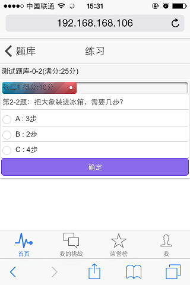

## 个人简历

---

### 求职意向
- _**JS工程师**_ 
- _**Java开发工程师**_
 
---

### 基本信息  

> _*5年半工作经验*_

|  --            |  --                   | --           | --          |
|----------------|-----------------------|--------------|-------------|
|_*姓名*_        |常\*                   |_*性别*_      |男           |
|_*出生年月*_    |1986-05                |_*所在城市*_  |北京         |
|_*毕业院校*_    |南昌航空大学(本科统招) |_*专业*_      |网络工程     |
|_*邮箱*_        |o52tiger@gmail.com     |_*QQ*_        |594463543    |

---

### 技术特点

>1. 对JavaScript相关技术有深入研究，熟练掌握_*Ext Js*_、_*Angular Js*_、JQuery等前端技术框架.

>2. 对_*Node.js*_相关技术有一定研究，熟练掌握Express框架、掌握Grunt、Jasmine、Yeoman 、Bower等工具使用.

>3. 对Html5、 CSS3等前端技术有较好掌握.

>4. 对J2EE相关技术有一定研究，包括Spring、ibates、Hibernate等.

>5. 对Java OSGI技术有一定研究，采用OSGI技术开发一个服务管理框架.

>6. 对Android开发有一定掌握，开发一个电视盒子上的看板管理应用.

>7. 对Oracle 、MySql、Mongodb等数据库有一定研究.

___

### 项目经验

#### 在线答题游戏 ####
___
>* **简介:** 该项目是一个基于Node.js开发的在线答题游戏，主要用户手机,平板电脑等移动设备。

>* **特色：** 采用web socket技术实现对战中各个参战人员的得分和答题进度同步，采用ionic技术界面实现IOS和Android界面。 

>* **关键技术：** Express, socket.io, ionic

>* **项目截图:** [更多截图](tg.md)

___

#### 项目管理（2014.02 - 2014.08）####
___

>* **简介:** 该系统主要用于企业中项目预算的编制、项目进度的跟踪反馈等。类似于微软的project软件。

>* **特色:** 在线的项目WBS分解，任务节点上的各种操作（升级、降级、前序后续任务设置、资源设置等）。自己实现树表格组件(并非使用Ext4以后提供的组件)，实现树表格和甘特图的联动，甘特图上的放大缩小功能。任务执行情况的图表展示等。

>* **关键技术:** rsclient(自己编写的一个框架) Spring Ext.js FusionCharts甘特图

>* **项目截图:** [更多截图](ps.md)

#### 看板管理（2013.04 - 2013.08） ####

>* **简介** 该平台主要用于将企业的生产情况实时显示在电子显示屏上(目前只支持在电视机上的显示)，

>* **特色:** 该平台主要由在线的看板设计平台、安卓客户端软件和看板管理控制台三部分组成。看板设计平台提供多种组件，用户可直接拖拽选取各种组件设计看板内容，提供的看板组件主要有：表格、富文本、滚动字幕、视频、音频、折线图、柱状图、饼图等常见图表类型；安卓客户端用于显示设计好的看板内容；看板管理控制台用于实时讲服务器信息推送到客户端

>* **关键技术:**  rsclient（自己编写的一个框架）Spring Ext JS Android、WebSocket

>* **项目截图:** [更多截图](kb.md)

#### WEB服务管理框架（2012.08 - 2012.11）####

>* **简介:** 该框架是基于 Java OSGI 技术开发(Equinox 实现)的一个后台服务管理框架。

>* **特色:** 该框架提供多种基本内置服务模块(动态配置管理、日志服务、数据源服务、Web Service 服务发布等)，基于该框架开发的应用系统可实现动态的服务安装、更新、卸载功能；分布式服务调用等。

>* **关键技术:** Java OSGI(Equinox实现)、cxf、spring、blueprint.

#### 全面预算和项目预算（2011.06 - 2012.06）####

>* **简介** 该平台提供一套在线的编制预算、预算执行情况分析功能。表

>* **特色:** 类似 _*Excel*_ 的预算编制方式，支持常用的计算公式(公式编制方式和 _*Excel*_ 一样)，支持批量设置公式，自动计算结果等常用Excel 功能。另外该系统还提供多种预算执行结果的分析报 

>* **关键技术:** Ext JS、FusionCharts图表 Oracle数据库

>* **项目截图:** [更多截图](bm.md)

#### 运营分析(2009.12 - 2010.01) ####

>* **简介** 该系统是一个 BI 系统，可对企业各种经营数据进行实时分析，主要由两部分组成：后台经营数据的 ETL、前台数据的灵活展现。

>* **职责:** 我主要负责前台程序开发，前台程序主要基于Ext JS 开发，提供丰富的组件库，用户可根据自己的业务需要设计各种形式的经营报告，组件库中最具特色的是多维交叉表格组件，该组件可根据维度结构不断展开，形成一个不断细化的经营报表。该系统是我参与开发的第一个业务系统，期间经过对 JavaScript 语言的深入学习和研究，让我逐渐认识到 JavaScript 语言的强大，也更加喜欢上这门编程语言。 

>* **关键技术:** Ext JS、FusionCharts、Oracle数据库

>* **[项目截图](opa.md)**
